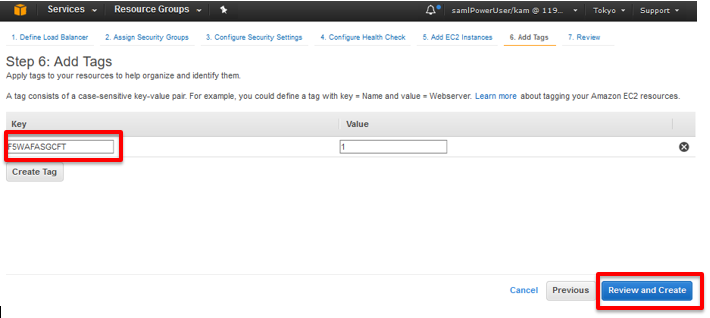

AWSの設定
=============================

IAMロールの設定 
-----------
IAMロールは、各種AWSサービスへのアクセスを安全に管理するためのIDです。
このCFTを展開するために使用するロールに対して必要なアクセス権を付与する必要があります。 

AWS CloudFormation ポリシーを作成 
~~~~~~~~
CloudFormationへのフルアクセスを許可する新しいポリシーを作成します。

#. AWS Management Console (https://aws.amazon.com/console/)にログインします。
#. **IAM** ショートカットをクリックします。
#. ナビゲーションペインで **Policies** をクリックし、 **Create policy** をクリックします。 

|task-1-1|

#. **Policy Generator** セクションで **Select** をクリックします。

|task-1-2|

#. 以下のようにアクセス許可を設定します。

|task-1-3|

#. **Add Statement** をクリックし、 **Next Step** をクリックします。

|task-1-4|

#. **Policy Name** を入力し、 **Create Policy** をクリックします。 

|task-1-5|

IAM Roleを作成
~~~~~~~~
デフォルトでは、新しいロールにはアクセス権がありません。 
このCFTをデプロイするために必要なポリシーを適用する必要があります。 

#. ナビゲーションペインで、Rolesをクリックし、Create new roleをクリックします。 

|task-1-6|

#. **Select role type** の画面で、 **AWS Service Role** セクションを展開します。
  **AWS CloudFormation Role** で **Select** をクリックします。

|task-1-7|

#. **Attach Policy** 画面で、フィルタボックスにポリシー名の最初の数文字を入力することで、
  リストをフィルタリングすることができます。以下のすべてのポリシーをフィルタリングし、
  そのチェックボックスをオンにします。終了したら、 **Next Step** をクリックします。
  
  - AmazonEC2FullAccess
  - IAMFullAccess
  - AutoScalingFullAccess
  - AmazonS3FullAccess
  - CloudWatchFullAccess
  - AmazonSNSFullAccess
  - cloudformation-full-access (前の手順で作成されたポリシー)

|task-1-8|

#. **Role name** を入力し **Create role** をクリックします。 

|task-1-9|

これで、IAM ロール設定は完了です。

Elastic Load Balancer (ELB) を作成
-----------
Classic Load Balancerの設定をします。

バックエンドサーバ用のELB作成
~~~~~~~~
WordPressサーバーへのロードバランシング用のAWS ELBを起動します。

#. **EC2** ショートカットをクリックします。 
#. ナビゲーションペインで、 **Load Balancers** をクリックし、 **Create Load Balancer** をクリックします。 

|task-1-10|

#. **Classic Load Balancer** を選択し、 **Continue** をクリックします。 

|task-1-11|

#. **Load Balancer name** にWordPress用のELBあることを示す名前入力しVPCを選択します。
  インターネットに公開する必要はないため、 **Create an internal load balancer** を選択します。
  **Available subnets** で、２つのプライベートサブネットを選択します。アベイラビリティーゾーンにつき、
  多くとも 1 つのサブネットしかアタッチできません。最後に **Next: Assign Security Groups** をクリックします。
  
|task-1-12|

#. **Select an existing security group** を選択し、 WordPress用のsecurity groupをクリックします。
  **Next: Configure Security Settings** をクリックし、続行します。
  
|task-1-13|

#. 以下の警告メッセージが表示されたら、 **Next: Configure Health Check** をクリックし、続行します。 

|task-1-14|

#. 以下のように **Health Check** を設定します。WordPressを利用する場合、 **Ping Path** のフィールドに 
  **「/」** を入力します。 **Next: Add EC2 Instances** をクリックします。

|task-1-15|

#. 両方のWordPressを選択し、 **Next: Add Tags** をクリックします。 

|task-1-16|

#. 本ガイドでは、 **Key** と **Value** を利用することにしました。
  この値はCFTによって作成されたオブジェクトをフィルタする場合などに用いる文字列となります。

|task-1-17|

#. 全ての設定を確認し、 **Create** をクリックします。 

|task-1-18|

完了しましたら、以下のページが表示されます。 

|task-1-19|

F5 WAF ELBを作成
~~~~~~~~
上記手順を繰り返して、F5 WAFデバイス用のインターネット向けELBを作成します。 

#. Load Balancerの名前を入力し、VPCを選択します。今度は **Create an internal load balancer**
  を選択しません。2つパブリックサブネット(サブネットのトラフィックがインターネットゲートウェイにルーティングされる)を選択し、
  **Next: Assign Security Groups** をクリックします。

|task-1-20|

#. **Select an existing security group** をクリックし、F5 WAF用の security groupを選択します。
  **Next: Configure Security Settings** をクリックします。
  
|task-1-21|

#. 前回と同様な警告メッセージが表示されたら、 **Next: Configure Health Check** をクリックします。

#. **Configure Health Check** の画面で、 **Ping Path** を **「/」** に変更し、
  **Next: Add EC2 Instances** をクリックします。
  
|task-1-22|

#. **Add EC2 Instances** の画面で、 インスタンスを選択しません。 **Next: Add Tags** をクリックします。 

|task-1-23|

#. WordPress用のELBと同一の **Key** と **Value** を入力し、 **Review and Create** をクリックします。

#. 全ての設定を確認し、 **Create** をクリックします。 

|task-1-24|

.. |task-1-1| image:: images/task-1-1.png

