F5 WAF Autoscale CloudFormation (CFT)テンプレートのデプロイ
=============================

AWS Marketplaceから起動
-----------

#. **EC2** ショートカットをクリックし、 **Launch Instance** をクリックします。
#. **AWS Marketplace** をクリックし、検索フォームに **f5** と入力し **Enter** キーを押します。 

   |task-2-1|

#. **F5 WAF Solution** が表示されるまで下にスクロールします。
   現在選択可能なAMIは **[25Mbps, 200Mbps, 1Gbps]**です。 

   |task-2-2|
  
#. 本ガイドでは以下のAMIを選択しました。 **More info** をクリックします。

   |task-2-3|

#. **F5 WAF Solution – 25Mbps product detail page on AWS Marketplace** をクリックします。

   |task-2-4|

#. AMIの詳細を確認します。 **Delivery Methods** のプルダウンで **Auto Scaling WAF via CFT** を選択します。

   |task-2-5|

   .. NOTE::
      上記手順と同様に、公式のF5 Networks GitHubリポジトリから同一CFTをデプロイすることも可能です。
      https://github.com/F5Networks/f5-aws-cloudformation/tree/master/supported/solutions/autoscale/waf#using-the-aws-launch-stack-button
   
   |task-2-6|

#. 全てのLaunch Optionsを確認し、 **Launch with CloudFormation Console** をクリックします。

   |task-2-7|

#. CloudFormationで以下のページにリダイレクトされます。 **Specify an Amazon S3 template URL** 
   が選択されていることを確認し、 **Next** をクリックします。
  
   |task-2-8|

#. 以下の用にCFTのパラメータを入力し **Next** をクリックします。

   |task-2-9|

   |task-2-10|

#. ELB作成時に使用した **Key** と **Value** を入力します。
   事前に作成した **IAM Role** を選択し、 **Next** をクリックします。

   |task-2-11|

#. 全てのCFT設定を確認後に、CAPABILITYの承認にチェックを入れスタックを作成します。
   最後に **Create** をクリックします。
  
   |task-2-12|

#. CloudFormation Stacksの画面で、更新ボタンをクリックしCFT展開状況を確認します。 

   |task-2-13|

   |task-2-14|

**Status** が **CREATE_COMPLETE** になるまで待ちます。（約5分程度かかります。）

   |task-2-15|

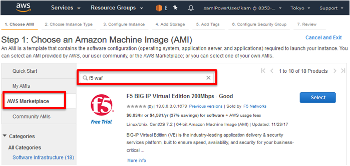
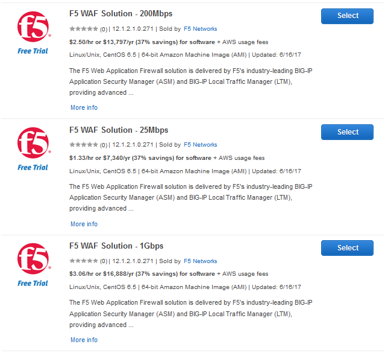
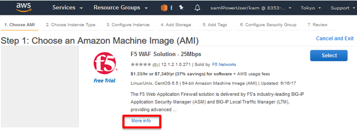
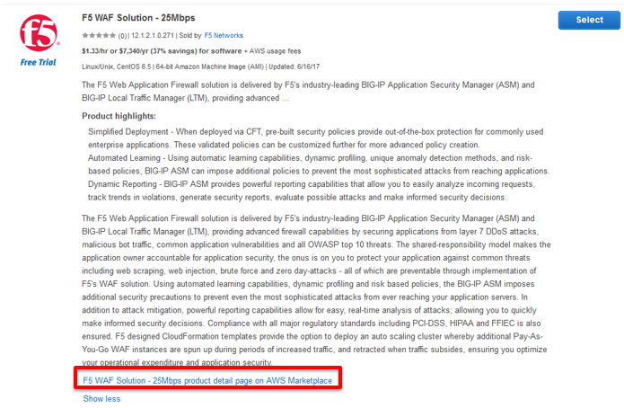
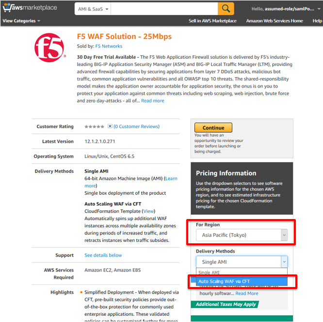
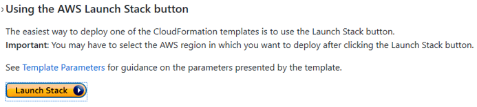
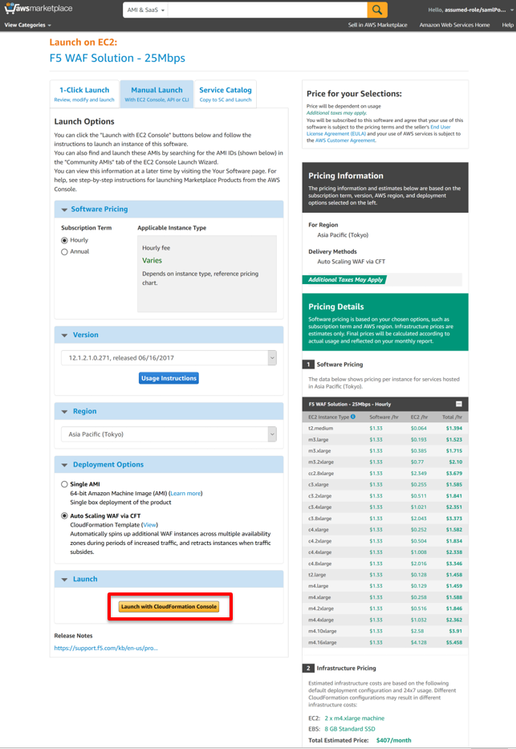
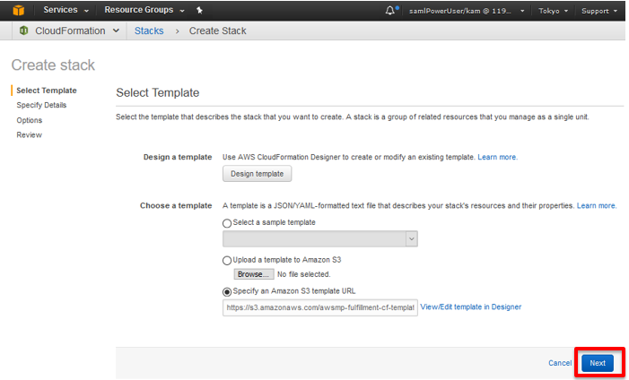
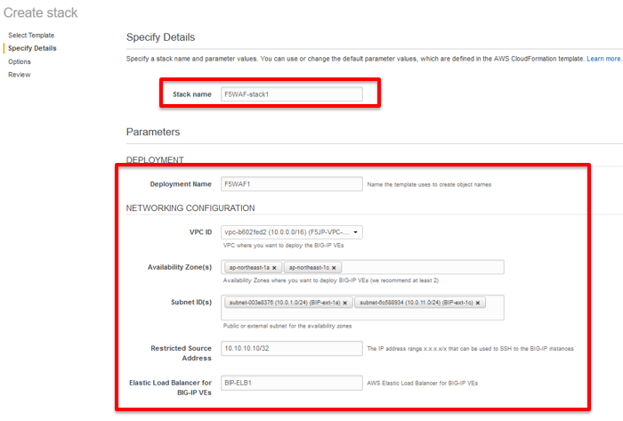
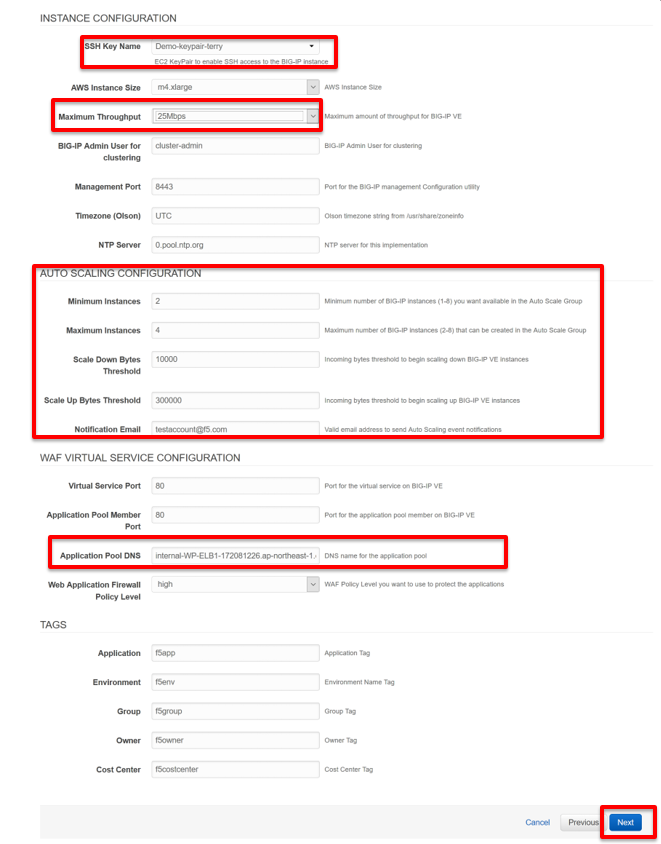
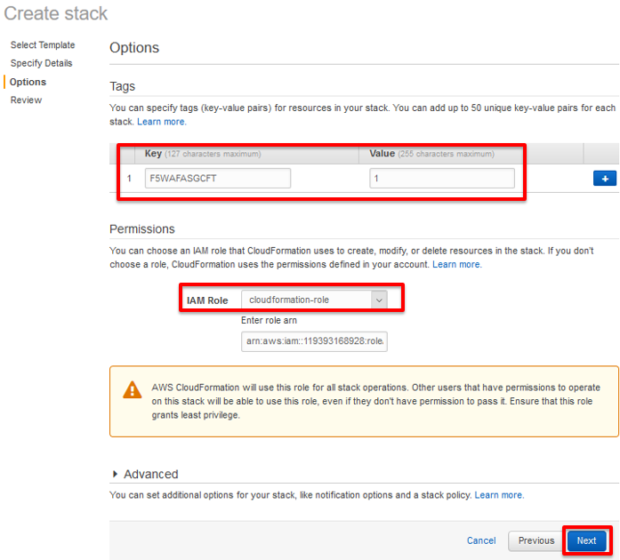
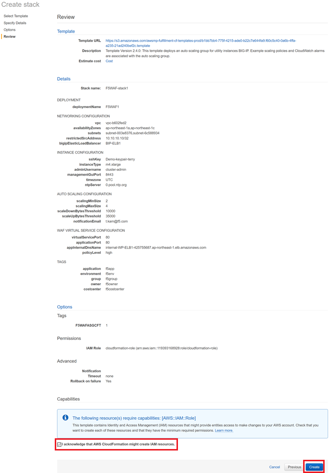
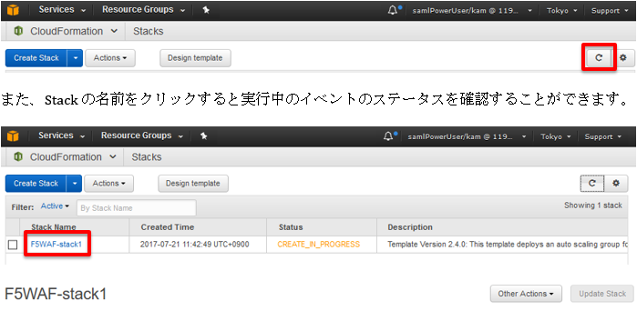
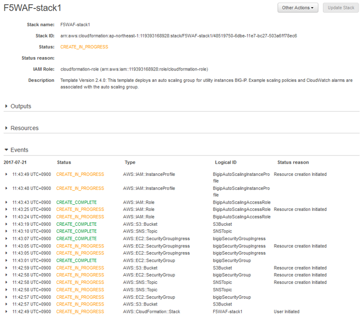
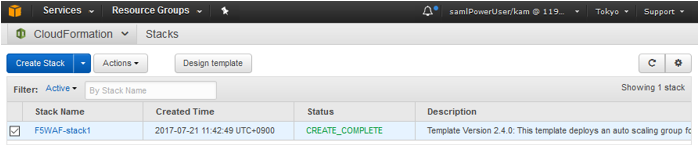