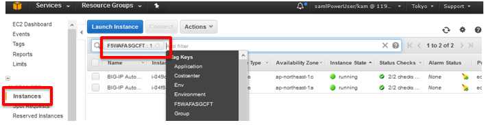
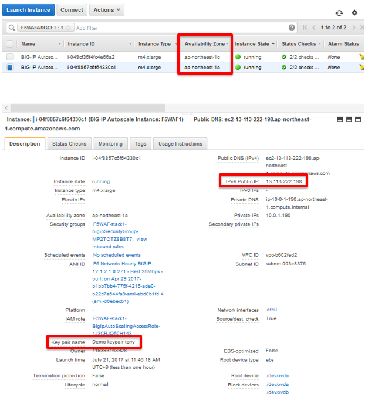
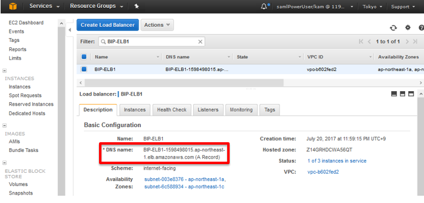
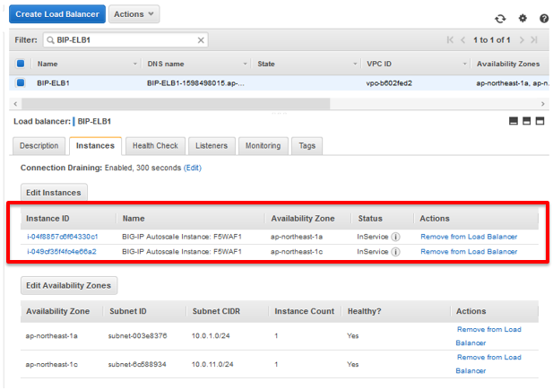
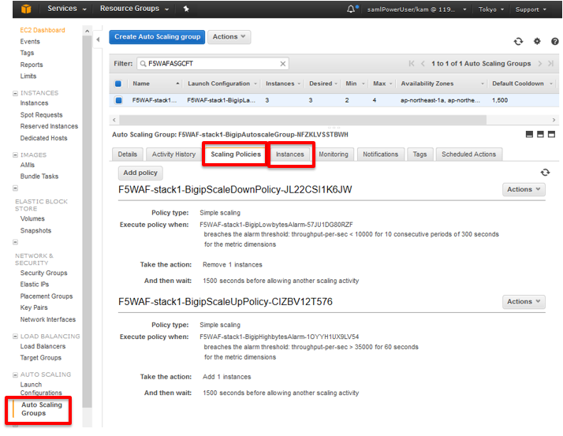
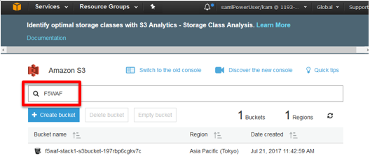
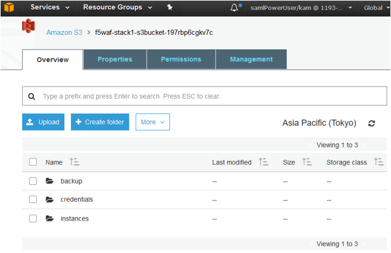

CFTによって作成されたオブジェクトの確認
=============================

F5 WAF設定確認
-----------

#. **EC2** ショートカットをクリックします。

#. ナビゲーションペインで、 **Instances** をクリックします。CFTデプロイ時に指定した
   **Tag Key** を入力しF5 WAFのインスタンスを検索します。

|task-3-1|

#. 各 **Availability Zones** 内に１台のF5 WAFが表示されます。それぞれをクリックすると
   **IPv4 Public IP** と指定した **Key pair name** が表示されます。
   この情報を使用してSSHでCLIにログインします。

   |task-3-2|   

F5 WAF 用のELB設定確認
-----------

#. ナビゲーションペインで、 **Load Balancers** をクリックし、F5 WAF用のELBを検索します。

#. **DNS name** を確認します。これを使用してクライアントからの接続を確認します。

   |task-3-3|

#. **Instances** タブをクリックし、F5 WAFが追加されていることを確認します。 

   |task-3-4|

AWS Auto Scaling Groups設定確認
-----------

#. ナビゲーションペインで、 **Auto Scaling Groups** をクリックし、テンプレートデプロイ時に
   指定された **Key** を使用してCFTによって作成されたAuto Scaling Groupを検索します。
   **Scaling Policies** と **Instances** を確認します。
  
   |task-3-5|

AWS S3 Bucket 設定確認
-----------

#. **S3** ショートカットをクリックし、CFTのデプロイ名を検索します。 

   |task-3-6|

#. CFTが作成したbucketをクリックしフォルダを確認します。

   |task-3-7|

