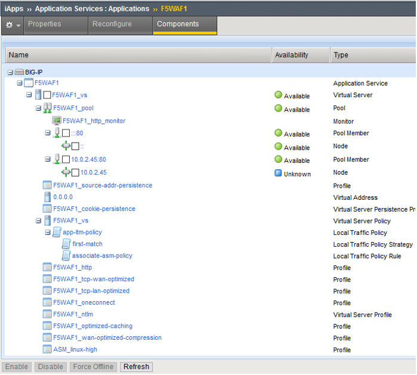
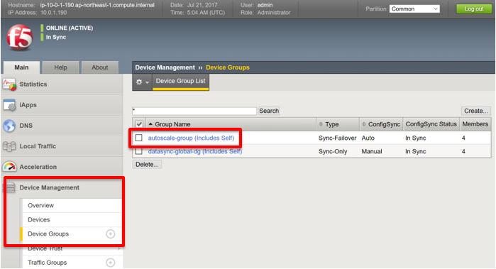

F5 WAFログインと設定確認
=============================

WebUIへのログイン用アカウント：adminのパスワードを設定します。そして、
CFTによって作成されたWAF設定も確認します。

WebUI パスワードの設定
-----------
Puttyもしくは他のターミナルソフトを使用してログインします。 

#. F5 WAFに割り当てたEIP に、PuttyでSSHアクセスします。
  SSH key pairを指定し **admin** でログインします。
  
|task-4-1|

#. TMSHで以下のコマンドを実行します。

.. NOTE::
   SSHログインしている状態で、 **run util bash** コマンドで
   bashに入っている場合は、 **exit** でTMSHに戻ります。） 

.. code-block:: console
   :linenos:
   
   login as: admin
   Authenticating with public key "imported-openssh-key"
   admin@(ip-10-0-1-190)(cfg-sync In Sync)(Active)(/Common)(tmos)# modify auth password admin
   changing password for admin
   new password:
   confirm password:
   admin@(ip-10-0-1-190)(cfg-sync In Sync)(Active)(/Common)(tmos)# save sys config

#. WebUI (https://<EIP>:8443) へのログイン用アカウント：admin
  を使用してログインします。必要に応じて証明書の警告をスキップして下さい。

|task-4-2|

F5 WAF 設定確認
-----------

#. **Local Traffic** > **Virtual Servers** で
  virtual server設定を確認します。
  
|task-4-3|

#. **Local Traffic** 配下で **Pools** をクリックしpool設定を確認します。
  **Members** カラムのリンクをクリックし、pool membersを確認します。 

|task-4-4|

|task-4-5|

#. **Security** > **Application Security** > **Policy** > 
  **Policy Properties** でWAFのポリシーを確認します。
  
|task-4-6|

#. iApp設定を確認します。F5WAFで生成するL4-7のオブジェクトは、
  iAppsというF5の設定テンプレート機能を通じて作成しています。
  iAppにより自動化とオーケストレーションを実現しています。
  
  **iApps** > **Application Services** > **Applications** でiApps設定を確認します。

|task-4-7|

Application Service 名をクリックし、iAppで設定されているコンポーネントを確認します。

|task-4-8|

Sync Group設定確認 
-----------
すべてのF5 WAFデバイスは、 WAFポリシーを含むすべての共有設定を同期させるために同じ同期グループに設定されています。

#. **Device Management** > **Device Groups** で、デバイスグループを確認します。 このautoscale-groupは、ローカルトラフィック設定とWAFポリシーオブジェクトの同期をします。

|task-4-9|

WordPress アプリケーションへの接続の確認
-----------
F5 WAF用のELBのDNS名でWebアプリケーションにアクセスが可能なことを確認します。
このDNS名はELBのPublic IPに解決され、Auto Scaling Group内の
F5 WAF (BIG-IP ASM)宛ての通信をロードバランスします。 

#. WebブラウザでF5 WAF ELBのFQDNに対してHTTPでアクセスします。 

|task-4-10|

