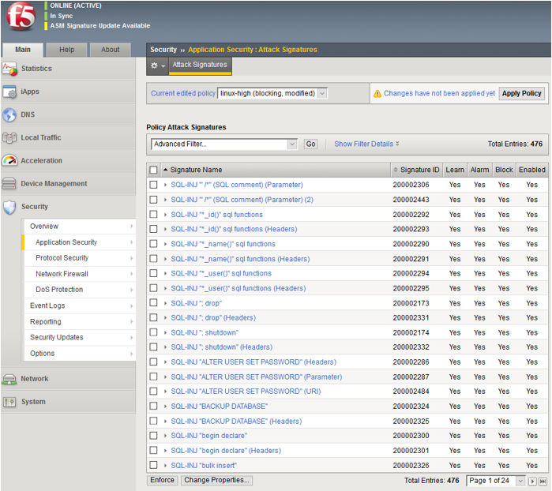
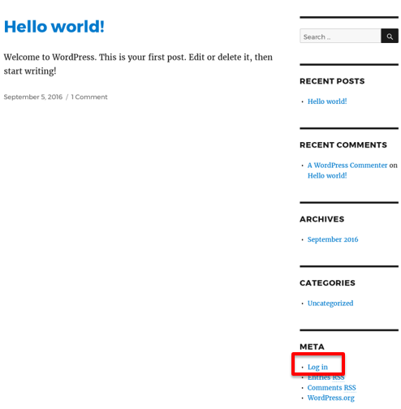
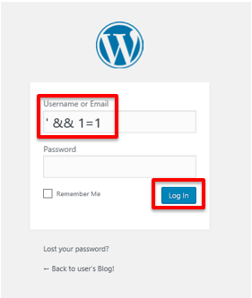
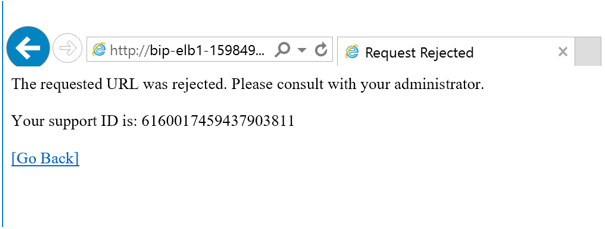
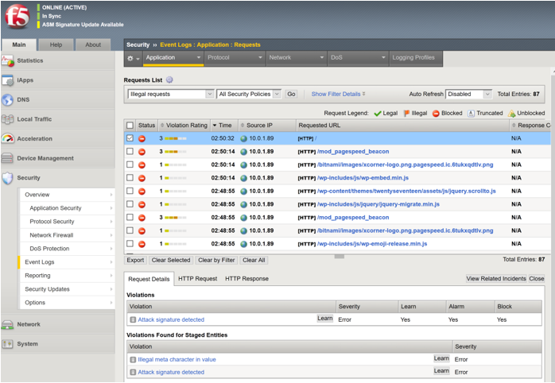

Security Policyのテスト (SQL Injection)
=============================
F5 WAFがWordPressアプリケーションに対する
SQLインジェクション攻撃をブロックすることを確認します。 

SQL インジェクション攻撃のシミュレーション
-----------
ASMのセキュリティポリシーには多くのSQLインジェクションに対するシグネチャがあります。
これらのシグネチャの内いずれかに該当する通信を発生させることにより、
攻撃の検知イベントを発生させることが可能です。

|task-5-1|

#. WordPress画面で、 **Log in** をクリックします。

|task-5-2|

#. 例えば WordPress の検索フォームに ``' && 1=1`` と入力し、
  SQL インジェクション攻撃を試みるとBIG-IP WAF (AFM) が
  攻撃ブロックすることが確認出来ます。

|task-5-3|

#. F5 WAF (ASM) がリクエストをブロックしたことを示すページが表示されます。 

|task-5-4|

#. F5 WAF の Event Logs に攻撃の詳細が表示されます。
  外部ログサーバーに送信するよう設定することも可能です。

|task-5-5|

