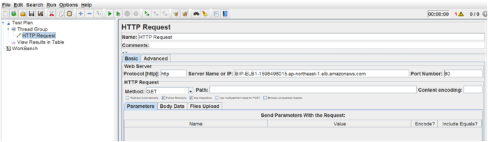

Autoscaleの動作確認
=============================
クライアント通信をシミュレートしたトラフィックを生成、
F5 WAFのscale outイベントをトリガーし、追加のインスタンスが
auto scaling group内に自動的にデプロイされることを確認します。

パフォーマンス試験用アプリケーションの起動
-----------
本ガイドではApache JMeter v3.2 を使用し、
F5 WAF 宛てのクライアント通信 (HTTP requests) をシミュレーションします。

http://jmeter.apache.org/ 

#. Thread Group を以下の例のように設定し、AWS の Scale out イベント
  を発生させます (パラメーターは試験環境に応じて、適宜調整して下さい)。 
  
|task-7-1|

#. 同様に、HTTP request を設定します。

|task-7-2|

Scale outイベントの確認
-----------

#. Scale out イベントの発生まで試験を続けます。 
#. **Activity History** タブで新しいインスタンスが
  作成されていること確認します。起動後、インスタンスは
  自動的にトラフィックの処理を開始します。
  
|task-7-3|

新しくデプロイされたF5 WAFはF5 WAF用の ELBにも自動的に追加されます。 

|task-7-4|

新しいF5 WAFが既存の同期グループに参加すると、すべての設定が同期され、
**Status** が **InService** に変更されます。 

