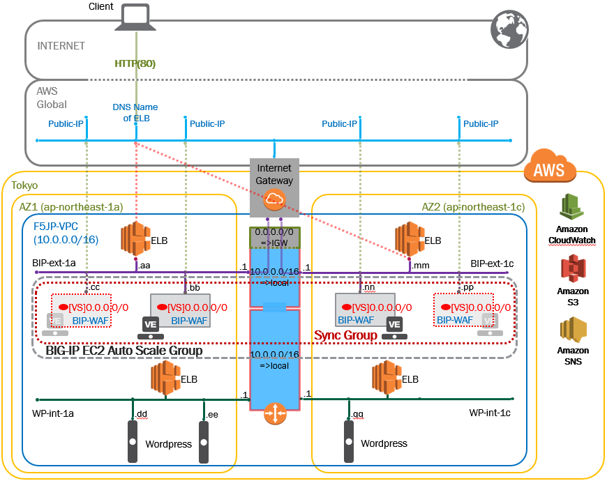

ネットワーク構成図
===================================================

このガイドで使用するネットワーク構成、およびコンポーネントは以下となります。 

   |nwzu_1|

+----------------------+--------------+-------------+
| Network              | Subnet CDR   | Subnet Type |
+======================+==============+=============+
| 1. BIP-ext-1a (AZ1)  | 10.0.1.0/24  | Public      |
+----------------------+--------------+-------------+
| 2. BIP-ext-1c (AZ2 ) | 10.0.11.0/24 | Public      |
+----------------------+--------------+-------------+
| 3. WP-int-1a (AZ1 )  | 10.0.2.0/24  | Private     |
+----------------------+--------------+-------------+
| 4. WP-int-1c (AZ2 )  | 10.0.12.0/24 | Private     |
+----------------------+--------------+-------------+

